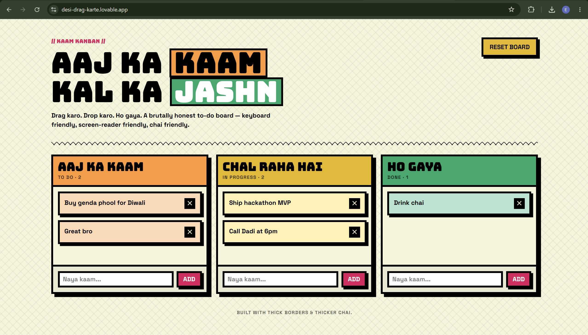
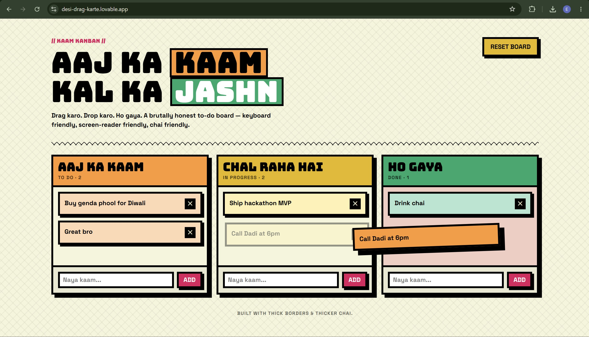

# 🎭 Kaam Kanban — Desi Brutalist To-Do Board

AAJ KA **KAAM** · KAL KA **JASHN**

A loud, tactile, and highly interactive drag-and-drop Kanban board designed in a bold **Indian Vernacular Neo-Brutalist** style. Built with thick borders, high-contrast colors, and robust web standards under the hood.

---

## 🔗 Live Demo & Screenshots

🔗 **Live Website**: [https://desi-drag-karte.lovable.app/](https://desi-drag-karte.lovable.app/)

### 📸 Application Previews

---

## 📌 Chosen Vertical & Theme

- **Vertical**: Personal Productivity & Task Management (Kanban Board).
- **Core Value Proposition**: Traditional project management tools are often clean, sterile, and monotone. **Kaam Kanban** breaks this mold with a vibrant "Desi" cultural aesthetic—using traditional colors (Marigold, Gulabi, Haldi, Peacock Green) on a Khadi background, wrapped in thick black borders and flat offset shadows. It proves that software can be loud, honest, and filled with personality, without sacrificing technical engineering quality.

---

## 🛠️ How the Solution Works

### 1. Unified State & SSR-Safe Persistence

The board is powered by a **Zustand** store with a persistence middleware:

- **State Store**: Manages columns, task listings, task insertions, and transitions.
- **SSR Safety**: The storage layer is built with an SSR-safe wrapper that falls back gracefully if executed on the server, avoiding any hydration mismatches.
- **Defensive Rehydration**: When the client reads the store from `localStorage`, a custom merge hook runs to validate the structure of the data and sanitize all input text, ensuring the application remains robust even if external client storage has been modified.

### 2. Accessible Drag & Drop Flow

Drag and drop is implemented using `@dnd-kit/core` and `@dnd-kit/sortable`:

- **Collision Detection**: Closest corners algorithm determines the intended drop zone.
- **Stable References**: Dynamic sorting lists are derived on the fly using `useMemo` so columns do not force re-renders on their sibling columns when their internal items do not change.
- **Pointer & Keyboard Interaction**: Fully supports standard pointer inputs (mouse, trackpad, touch) and keyboard inputs (e.g., spacebar to grab, arrows to reorder, spacebar to drop).

---

## ⚙️ Approach and Logic

### Math-Driven State Reordering

When a task is dragged across columns or reordered internally, the state transition must be absolute and side-effect free.

- The `moveTask` handler removes the task from its existing index, shifts tasks in the target column, and inserts the target item at the correct destination index.
- A pure utility function `computeMove` is exported separately to run calculations out-of-store, allowing the core transition logic to be completely covered by unit tests.

### Defense in Depth (XSS Sanitizer)

Inputs are sanitized using a custom `sanitizeText` utility before reaching the state:

- Angle brackets (`<`, `>`) and control characters are completely stripped.
- `javascript:` URI patterns are neutralized.
- Text is trimmed and capped to a maximum of 200 characters to prevent database/memory bloat.

---

## 🎯 Evaluation Criteria Coverage

Our implementation aligns directly with the PromptWars **Parameter Impact Breakdown** parameters:

### 🔴 High Impact (Most Important)

- **Code Quality**:
  - **Clean, readable, and well-structured code**: Fully typed with TypeScript, modularized into distinct routing, state, visual, and utility files.
  - **Linting & Formatting compliance**: Strictly clean of ESLint errors and standardized with Prettier formatting across the codebase.
- **Problem Statement Alignment**:
  - **Targets core challenge & user needs**: Provides a fully interactive Kanban workspace allowing creation, drag-and-drop movement, and deletion of tasks.
  - **Task Title Inline Editing**: Supports instant rename by double-clicking a task title or clicking the edit icon (`✎`), preserving layout and state.
  - **Thematic Consistency**: Leverages custom brutalist tokens to match the "Desi Brutalism" brand aesthetic.

### 🟡 Medium Impact (Under-the-Hood)

- **Security**:
  - **Defense-in-depth sanitization**: Cleans inputs upon both task creation and title editing using the regex-based `sanitizeText` helper (stripping tags, control chars, and `javascript:` URIs).
  - **State Integrity**: Integrates custom merge schemas during localStorage hydration to prevent corruption and defend against tampered state payloads.
- **Efficiency**:
  - **Optimal use of time & memory**: Derives individual column task lists via `useMemo` so adding/moving cards doesn't trigger parent-child re-computation on other columns.
  - **Render skip optimizations**: Columns and TaskCards use `React.memo` and stable callback wrappers (`useCallback`).
  - **Stable Sensor Event Listeners**: Memoizes `@dnd-kit` Pointer and Keyboard sensor configuration parameters inside `useMemo` hooks, preventing unnecessary event listener re-bindings.

### 🟢 Low Impact (Fine Polish)

- **Testing**:
  - **Easily testable & maintainable code**: Pure state transitions and math calculations are extracted out-of-store (e.g. `computeMove`).
  - **Vitest Unit Test coverage**: The test suite (`src/store/kanbanStore.test.ts`) verifies core movement transitions, XSS input sanitization rules, and corrupted parse fallbacks with 12 fully passing tests.
- **Accessibility**:
  - **Usable for diverse environments & assistive tech**: Operates with custom sensory guidelines, explicit `aria-label` elements, and a dedicated `aria-live="polite"` status region to output real-time screen-reader readouts.
  - **Full Keyboard coordination**: Dragging operations, column movements, and inline title edits (save/cancel) can be fully triggered and completed via keyboard shortcuts alone.

---

## 💭 Assumptions Made

1. **Target Environment**: Modern web browsers supporting ES modules, localStorage, and standard Web APIs (e.g., `crypto.randomUUID`).
2. **Fixed Layout**: The columns are locked to three key stages ("Aaj Ka Kaam" / To-Do, "Chal Raha Hai" / In Progress, and "Ho Gaya" / Done) which fits the simple, focused scope of this productivity board.
3. **Local Storage Single-User**: This is designed as a client-first application where tasks are kept private and local to the user's browser storage.
